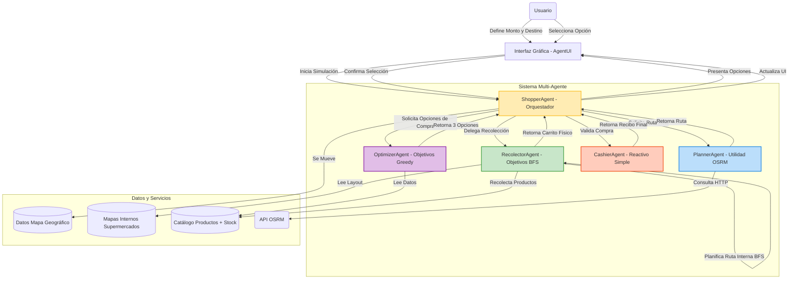

# Arquitectura Actualizada del Sistema Multi-Agente

## Cambios Clave en la Arquitectura

1.  **Nuevo Agente (Recolector)**: Se encarga exclusivamente de la navegación interna y recolección física de productos, separando esta responsabilidad del Shopper o el Optimizador.
2.  **Interacción Humana (Selección)**: El flujo ya no es 100% automático; incluye una pausa para que el usuario elija entre opciones optimizadas, añadiendo un nivel de simulación de "preferencia humana".
3.  **Datos de Mapas Internos**: Nueva fuente de datos estructurada (`InternalMaps`) que permite la navegación BFS detallada sección por sección.
4.  **Optimización Diferida**: El Optimizador ahora genera múltiples escenarios potenciales en lugar de decidir uno solo, dando más poder de decisión al usuario (o simulando indecisión).
