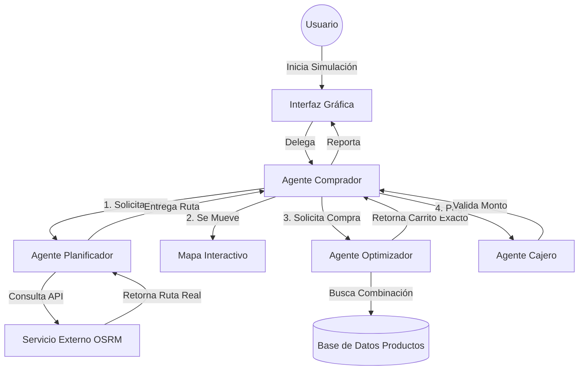

# INFORME DEL PROYECTO: SISTEMA MULTI-AGENTE "VALE NAVIDEÑO"

**Materia**: Inteligencia Artificial I  
**Proyecto**: Segundo Parcial  
**Tema**: Planificación, Recurso Dinero y Agentes  

---

## 1. Planteamiento del Problema

El proyecto consiste en el desarrollo de un **sistema de simulación basado en agentes** (Multi-Agent System) enfocado en la resolución del problema del "Vale Navideño".

### Descripción del Desafío
Un agente inteligente (el Comprador) debe canjear un vale navideño por un monto específico de dinero (ej. 500 Bs, 1000 Bs, etc.) en una cadena de supermercados (Hipermaxi). El objetivo principal es **gastar el monto exacto** del vale adquiriendo productos reales, maximizando el uso del recurso dinero sin excederse ni un centavo.

### Requerimientos Específicos
*   **Multi-Agentes**: Implementación de al menos 2 agentes interactuantes.
*   **Entorno**: Mapa real de la ciudad de Cochabamba con 7 sucursales de Hipermaxi.
*   **Restricciones**: El monto de compra debe ser **exacto** al del vale.
*   **Tecnología**: Lenguaje Python.

---

## 2. Planificación y Diseño

### Arquitectura Multi-Agente
Se ha diseñado una arquitectura colaborativa donde cada agente tiene una responsabilidad única y especializada.

### Definición de Agentes

| Agente | Tipo | Rol y Responsabilidad |
| :--- | :--- | :--- |
| **Agente Comprador (Shopper)** | **Basado en Objetivos** | Es el **Orquestador**. Su objetivo es completar la misión de canje. Coordina a los demás agentes y mantiene el estado de la simulación. |
| **Agente Planificador (Planner)** | **Basado en Utilidad** | Su función es maximizar la eficiencia del movimiento encontrando la ruta más corta y realista a través de las calles de la ciudad. |
| **Agente Optimizador (Optimizer)** | **Basado en Objetivos** | El "cerebro" matemático. Su objetivo es encontrar una combinación de productos cuya suma sea $S = Monto\_Vale$. |
| **Agente Cajero (Cashier)** | **Reactivo Simple** | Actúa bajo la regla: `SI (Total_Carrito == Monto_Vale) ENTONCES Aprobar SINO Rechazar`. |

---

## 3. Implementación Técnica

El sistema ha sido desarrollado en **Python 3.12**, utilizando **Tkinter** para la interfaz gráfica y programación orientada a objetos para los agentes.

### Módulos Principales

#### 3.1. Algoritmo de Optimización (`agents/optimizer.py`)
Para resolver el problema de la "Suma de Subconjuntos" (Subset Sum Problem) con repetición, implementamos un algoritmo híbrido en dos fases para garantizar eficiencia y variedad:

1.  **Fase 1: Greedy Aleatorizado (Randomized Greedy)**
    *   Selecciona productos "principales" (precio > 2 Bs) al azar.
    *   Llena el carrito rápidamente hasta acercarse al monto objetivo.
    *   *Innovación*: Si la brecha es grande (> 1000 Bs), añade múltiples unidades del mismo producto para acelerar el proceso.

2.  **Fase 2: Cambio de Moneda (Change Making)**
    *   Para los centavos restantes, utiliza productos "de relleno" (precio ≤ 2 Bs).
    *   Ordena estos productos de mayor a menor precio y aplica un algoritmo voraz para cerrar la brecha a 0.00 Bs exactos.

#### 3.2. Planificación de Rutas (`agents/planner.py`)
En lugar de una distancia euclidiana simple, integramos el servicio **OSRM (Open Source Routing Machine)**.
*   El agente envía coordenadas GPS (Latitud, Longitud).
*   Recibe una geometría de ruta que respeta el sentido de las calles y avenidas reales de Cochabamba.
*   Esto añade un nivel de realismo superior a la simulación.

#### 3.3. Interfaz Gráfica (`ui/interface.py`)
*   **Tecnología**: `ttkbootstrap` para estilos modernos y `tkintermapview` para mapas interactivos (Tiles de Google Maps).
*   **Funcionalidad**: Permite al usuario seleccionar el punto de partida haciendo clic en el mapa, elegir la sucursal destino y definir el monto del vale.
*   **Feedback**: Muestra logs en tiempo real traducidos al español para que el usuario entienda "qué está pensando" cada agente.

---

## 4. Pruebas Realizadas

### Caso 1: Compra Estándar (50 Bs)
*   **Entrada**: Vale de 50 Bs, destino "Hipermaxi El Prado".
*   **Resultado**: El agente generó una ruta real y compró una mezcla de abarrotes y snacks. El cajero aprobó la transacción con 50.00 Bs exactos.

### Caso 2: Monto Elevado (20,000 Bs)
*   **Entrada**: Vale de 20,000 Bs.
*   **Resultado**: El algoritmo respondió en < 1 segundo. Utilizó la lógica de "multiplicación de items" (llevando 11 unidades de productos caros) para llenar el monto rápidamente.

### Caso 3: Manejo de Errores
*   **Prueba**: Ingresar monto negativo o desconectar internet.
*   **Resultado**: El sistema valida entradas robustamente y muestra alertas claras en la UI sin colapsar.

*(Espacio reservado para capturas de pantalla de la ejecución)*

---

## 5. Conclusiones

1.  **Eficacia de la Arquitectura Multi-Agente**: La separación de responsabilidades permitió desarrollar módulos complejos (como la optimización matemática y el mapeo) de forma independiente y luego integrarlos limpiamente.
2.  **Solución al Problema del Cambio**: El enfoque híbrido (Aleatorio + Exacto) demostró ser superior a un enfoque puramente aleatorio (que tardaría infinito) o puramente voraz (que sería determinista y aburrido). Se logró simular una compra "humana" y matemáticamente perfecta.
3.  **Realismo**: La integración de mapas reales transforma un ejercicio teórico en una herramienta visualmente impactante y aplicable a problemas logísticos reales.

El proyecto cumple satisfactoriamente con todos los requisitos de la materia, demostrando la aplicación práctica de conceptos de IA en un entorno simulado pero realista.
